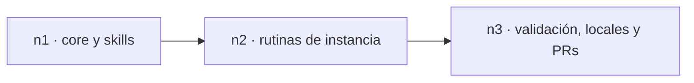

<!-- agent-generated:sesion runtime=codex branch=codex/skills/correccion-cierre -->

# Corrección de skills y retirada de portable

Alcance aprobado el 2026-10-05: conservar el flujo anterior de cierre, incorporar contexto compartido y brief único, retirar la segunda fuente portable y actualizar instalaciones locales. Los skills están en inglés.

## Decisiones

- Fuentes existentes: skills privados y exports sanitizados; no segunda carpeta portable.
- Wind-down conserva propuesta, ejecución, shortcuts, memoria, planes y reglas de merge.
- Handover conserva vista previa/confirmación independiente; durante cierre reutiliza su autorización.
- Jump conserva arquetipos, niveles y plantillas.
- Project sync conserva fuentes y contrato; solo retira scratch identificado de esta sesión.
- Snapshot y métricas opcionales dentro del CLI, sin instalar runtime independiente.
- Los filtros experimentales no se ejecutan desde las rutinas activas.
- Instrucciones: AGENTS.md. Scripts: rutas comprobadas. Sin reemplazos indiscriminados de marca.

## Verificación y entrega

Verificado: 21 pruebas del core pasan; YAML de los cuatro skills válido conservando user-invocable; 16 comparaciones de fuentes e instalaciones pasan; diff --check pasa. El validador genérico de skills no reconoce el campo histórico user-invocable, por lo que se comprobó el frontmatter con YAML y se preservó ese campo.

Los cambios de la instancia se entregan en un PR complementario. No se fusionan automáticamente.

---
🤖 _Claude Code · sesion → codex/skills/correccion-cierre · 2026-10-05_
