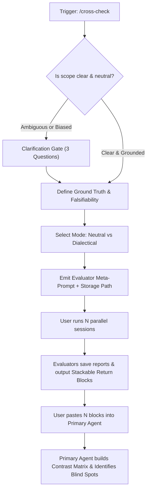

# cross-check

Spin up independent, blind evaluations across parallel agent sessions (different models, different harnesses, or fresh clean contexts). Use this skill when active reasoning suffers from confirmation bias, context rot, or premature hypothesis lock-in.

The skill produces three coordinated deliverables:
1. **A Decoupled Evaluator Prompt:** Strips prior conjectures and anchors to feed external agents only raw, verifiable facts.
2. **An Isolated Persistence Target:** Directs each evaluator to write its full report to `.analysis/<slug>/eval-<id>.md`, preventing working tree collisions across parallel runs.
3. **A Stackable Return Block:** A standardized snippet emitted by each evaluator that the user can copy and paste consecutively into the primary agent session for automated comparative synthesis.

---

## Workflow



---

## 1. Clarification Gate

Before composing the external evaluation prompt, verify whether the problem definition is objective and factual.

If the prompt from the current session contains speculative conclusions (e.g., *"Investigate why the database timed out because of connection pool starvation"*), **halt and request clarification on these three fields**:

1. **Neutral Question / Decision:** The core question without pre-baked answers (e.g., *"What is the root cause of timeout spikes in module X under sustained load?"*).
2. **Observable Raw Sources:** Concrete file paths, commit hashes, metrics tables, or raw logs (`file:///...`).
3. **Falsifiability Criterion:** What empirical finding or counter-example would definitively invalidate the prevailing hypothesis?

---

## 2. Blind Framing Rules

To preserve epistemic independence across evaluators:

- **Zero Conjecture Leakage:** Never include the primary agent's working theories, intermediate debates, or emotional tone.
- **Direct Pointers:** Pass absolute or workspace-relative links to raw source files so evaluators read ground truth instead of paraphrased snippets.
- **Isolated File Namespace:** Require evaluators to write comprehensive findings to `.analysis/<slug>/eval-<id>.md` (e.g., `eval-sonnet.md`, `eval-gemini.md`, `eval-1.md`). Add `.analysis/` to `.gitignore` if not already ignored.

---

## 3. Evaluation Modes

Offer two operational modes depending on the nature of the inquiry:

### Mode 1: Neutral Blind (Default)
The exact same neutral prompt is dispatched across N fresh sessions. Best for unbiased consensus and anomaly detection.

### Mode 2: Dialectical Tension (Contrast Roles)
Generates role-differentiated prompts to stress-test critical decisions from divergent angles:
- **Role A (Evidence Auditor):** Rigorously checks whether numbers, telemetry, and source code actually support the claims.
- **Role B (Devil's Advocate / Skeptic):** Actively searches for edge cases, race conditions, architecture anti-patterns, and reasons why the proposed solution will fail.
- **Role C (Pragmatic Juror / Minimalist):** Searches for simpler alternative explanations (Occam's razor) and assesses operational blast radius.

---

## 4. Evaluator Prompt Template

Emit the generated prompt in a copy-ready block:

````markdown
You are an independent evaluator on a blind cross-check panel. Your mandate is to analyze the situation below from scratch, free of prior assumptions or session bias.

### Objective
[NEUTRAL_DECISION_OR_DIAGNOSIS_TARGET]

### Data Sources
Inspect these files and data points directly:
- [RAW_FILE_OR_LOG_PATH_1]
- [RAW_FILE_OR_LOG_PATH_2]

### Guardrails
- Rely only on verifiable facts from the provided sources. Do not extrapolate without labeling assumptions.
- Explicitly state what evidence would disprove your findings.
- Falsifiability standard: [FALSIFIABILITY_CRITERION].

### Deliverable Instructions
1. Write your full, exhaustive technical analysis to:
   `.analysis/[SLUG]/eval-[EVALUATOR_ID].md`
   (Create the folder if it does not exist).

2. Output ONLY the following return block in the chat response, populating the bracketed fields:

```markdown
### [CROSS-CHECK RESULT - Evaluator: [EVALUATOR_ID]]
> Directive for receiving agent: Ingest this evaluation into the contrast matrix. If multiple evaluation blocks appear in this message, batch-process all of them before replying.

- **Verdict / Primary Thesis:** [Direct conclusion in 1-2 sentences]
- **Key Evidence:** [1-3 critical file paths, line numbers, or telemetry data points]
- **Blind Spots & Discrepancies:** [Factors contradicting the obvious view, or unaddressed risks]
- **Confidence:** [High | Medium | Low - brief justification]
- **Full Report:** `.analysis/[SLUG]/eval-[EVALUATOR_ID].md`
```
````

---

## 5. Primary Agent Synthesis Protocol

When the user returns to the primary session and pastes one or more `[CROSS-CHECK RESULT]` blocks consecutively, the primary agent must adhere to this ingest protocol:

1. **Defer Immediate Judgment:** Do not dismiss dissenting opinions or prematurely declare victory for the initial hypothesis.
2. **Render a Native Markdown Contrast Matrix:**

| Dimension | Initial Hypothesis | Evaluator 1 | Evaluator 2 | Consensus vs Dissent |
|---|---|---|---|---|
| Root Cause / Decision | ... | ... | ... | ... |
| Primary Evidence | ... | ... | ... | ... |
| Overlooked Risks / Gaps | ... | ... | ... | ... |

3. **Expose Blind Spots:** Answer explicitly:
   - What did the independent evaluators discover that was completely missed or discounted in this session?
   - Where do all evaluators agree unanimously?
   - What fundamental disagreements remain, and what single empirical test or probe would resolve them?
4. **Actionable Resolution:** Formulate the final conclusion or next step anchored in the triangulated evidence.
